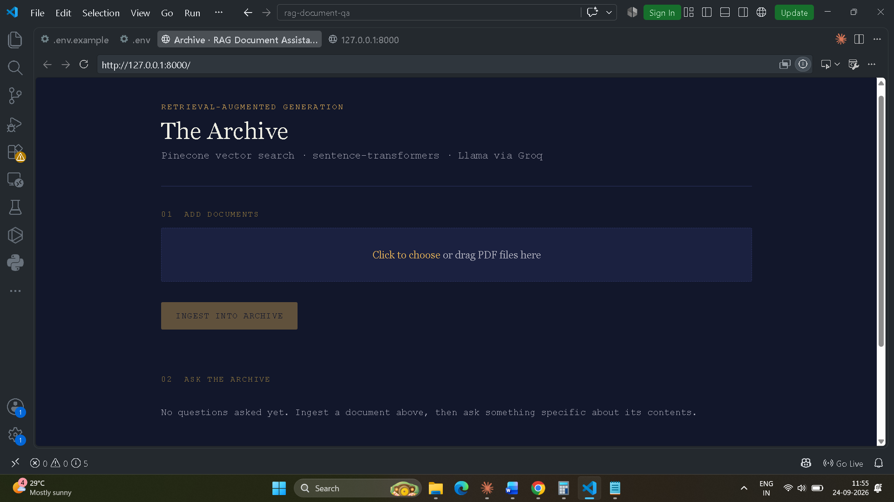

# RAG Document Q&A System

Ask questions about your PDF documents and get answers grounded in their content, with the source file and page cited for every answer.

**Live demo:** _add link after deployment_  
**Stack:** Python · FastAPI · Pinecone · Sentence Transformers · Groq API (GPT-OSS 120B) · SQLite · Docker

 <!-- add a screenshot to docs/ -->

---

## How it works

```
                 INGESTION                                      QUESTION ANSWERING
PDF upload                                       User question
   │                                                 │
   ▼                                                 ▼
Text extraction (pypdf, page by page)            Embed question (all-MiniLM-L6-v2)
   │                                                 │
   ▼                                                 ▼
Recursive chunking (500 chars, 50 overlap)       Pinecone similarity search (cosine, top-4)
   │                                                 │
   ▼                                                 ▼
Embeddings (all-MiniLM-L6-v2, 384-dim)           Prompt = retrieved chunks + question
   │                                                 │
   ▼                                                 ▼
Pinecone serverless index  ◄──────────────────   GPT-OSS 120B via Groq API
(text + file + page as metadata)                     │
                                                     ▼
                                         Grounded answer + [Source N] citations
                                         (declines if the answer is not in the documents)
                                                     │
                                                     ▼
                                         Logged to SQLite (question, answer, timing, sources)
```

## Features

- Upload one or more PDFs through the web page or the API
- Custom recursive character text splitter (paragraph → line → sentence → word)
- Semantic search over a Pinecone serverless index
- Answers restricted to the retrieved context, with file and page citations
- Re-uploading the same PDF overwrites its vectors instead of duplicating them (deterministic vector IDs)
- Every question is logged to SQLite with response times; `/api/stats` and `sql/analysis.sql` summarise usage
- Evaluation script that measures retrieval hit rate, correct refusals and response time
- Docker image ready for any container host; demo mode that disables public uploads

## Project structure

```
├── main.py                  FastAPI app: web page + REST API
├── pipeline.py              Orchestrates ingestion and question answering
├── config.py                Settings loaded from environment variables
├── ingest.py                Command-line ingestion of a folder of PDFs
├── loaders/pdf_loader.py    PDF text extraction (pypdf)
├── splitters/text_splitter.py   Recursive character text splitter
├── embeddings/sentence_transformer.py   Embedding model wrapper
├── vectorstores/pinecone_store.py       Pinecone index: upsert + query
├── generators/groq_generator.py         Prompt building + Groq LLM call
├── storage/query_log.py     SQLite query log
├── sql/analysis.sql         Example SQL queries on the log
├── eval/evaluate.py         Evaluation script
├── templates/index.html     Web interface
├── Dockerfile
└── requirements.txt
```

## Setup

You need free API keys from [Pinecone](https://www.pinecone.io/) and [Groq](https://console.groq.com/keys).

```bash
git clone https://github.com/ruttvajrk/rag-document-qa.git
cd rag-document-qa
python -m venv .venv
source .venv/bin/activate        # Windows: .venv\Scripts\activate
pip install -r requirements.txt
cp .env.example .env             # Windows: copy .env.example .env
# open .env and add PINECONE_API_KEY and GROQ_API_KEY
```

## Run

```bash
uvicorn main:app --reload
```

Open http://localhost:8000, upload a PDF, then ask a question.

Or ingest a whole folder from the command line:

```bash
python ingest.py ./data
```

## Run with Docker

```bash
docker build -t rag-document-qa .
docker run -p 8000:8000 --env-file .env rag-document-qa
```

## API

| Method | Path | Body | Returns |
|---|---|---|---|
| GET | `/` | – | Web interface |
| POST | `/api/ingest` | multipart form, field `files` (PDFs) | files ingested, chunks indexed |
| POST | `/api/ask` | `{"question": "...", "top_k": 4}` | answer, sources, timing |
| GET | `/api/stats` | – | question count, average response times, most-retrieved documents |
| GET | `/api/health` | – | `{"status": "ok"}` |

Example:

```bash
curl -X POST http://localhost:8000/api/ask \
  -H "Content-Type: application/json" \
  -d '{"question": "What is the refund policy?"}'
```

## Example questions and answers

_Add 2–3 real questions and the answers your app gave, with the PDF you used._

## Evaluation

1. Copy `eval/questions_template.csv` to `eval/questions.csv`.
2. Write about 20 questions whose answers you know (`in_doc`, with the expected file and page) and about 5 questions the documents do not cover (`out_of_doc`).
3. Start the app, then run:

```bash
python eval/evaluate.py --url http://localhost:8000 --questions eval/questions.csv
```

Test set: 25 hand-written questions on 2 public PDFs (an HR grievance policy and an RTI FAQ; 19 pages, 88 chunks) — 20 answerable from the documents, 5 not.

| Metric | Result |
|---|---|
| Retrieval hit rate (expected page in top-4) | 19/20 |
| Answers fully correct (manually checked) | 17/20 |
| Correct refusals on out-of-document questions | 5/5 |
| Median / average response time | 1.16 s / 1.81 s (retrieval 0.57 s + generation 1.25 s), measured on _your processor_ |

**Errors found:** the model once misread an exclusion list (answered that promotions are covered when the policy excludes them), and once retrieval returned a general rule instead of a specific exception on another page. One answer was incomplete.

**Model change:** Groq retired `llama-3.3-70b-versatile` in August 2026; the app now uses `openai/gpt-oss-120b`, set via `GROQ_MODEL` in `.env`.

## Query log (SQL)

```bash
sqlite3 logs/query_log.db < sql/analysis.sql
```

## Deployment

The Docker image runs on any container host. Set `PINECONE_API_KEY` and `GROQ_API_KEY` as secrets on the host, never inside the image. For a public demo, set `ALLOW_UPLOADS=false` and ingest your sample PDFs with `python ingest.py` from your own machine first.

## Known limitations

- Scanned PDFs (images without a text layer) are skipped; no OCR.
- If a PDF is edited and re-uploaded with fewer chunks, old extra chunks stay in the index.
- The SQLite log lives inside the container and is lost when it restarts, unless a volume is mounted.
